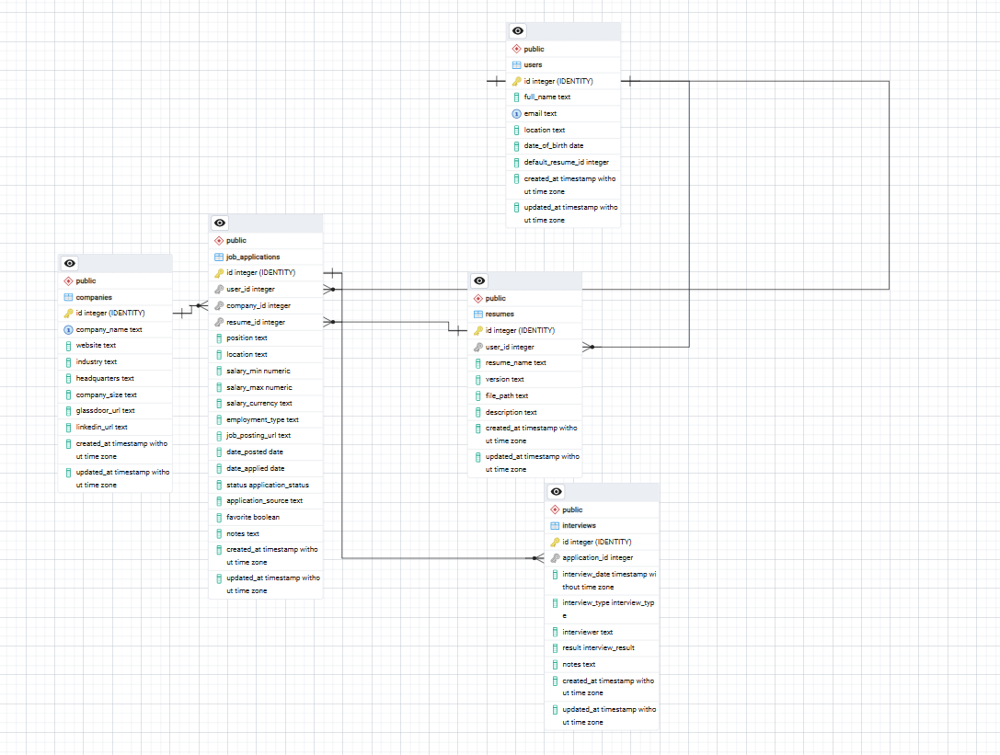

# Job Tracker

A full-stack web application that helps users organize and track their job search.

Users can save companies, manage resume versions, track job applications, schedule interviews, and view application statistics through an interactive dashboard.

## Why I Built This

I wanted to build a project that solved a real problem I experienced while job searching.

Instead of tracking applications in spreadsheets, I wanted to create a centralized application that stores companies, resume versions, interviews, and application statuses while giving meaningful statistics about my job search.

The goal is to strengthen my backend development, SQL, PostgreSQL, REST API, and React skills while creating a project I would actually use.

## Database

ERD

Tables

- Users
- Companies
- Resumes
- Job Applications
- Interviews